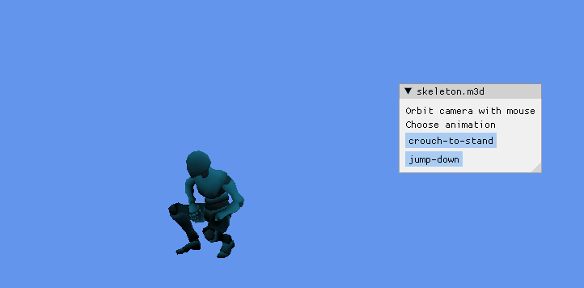

# M3D Viewer
This utility can be used to visualise animated Model 3D files on Windows.
It was written in C++, with the following dependencies:
- [DirectX12 Toolkit](https://github.com/microsoft/DirectXTK12)
- [Dear ImGui](https://github.com/ocornut/imgui)
- [Native File Dialog](https://github.com/btzy/nativefiledialog-extended)

